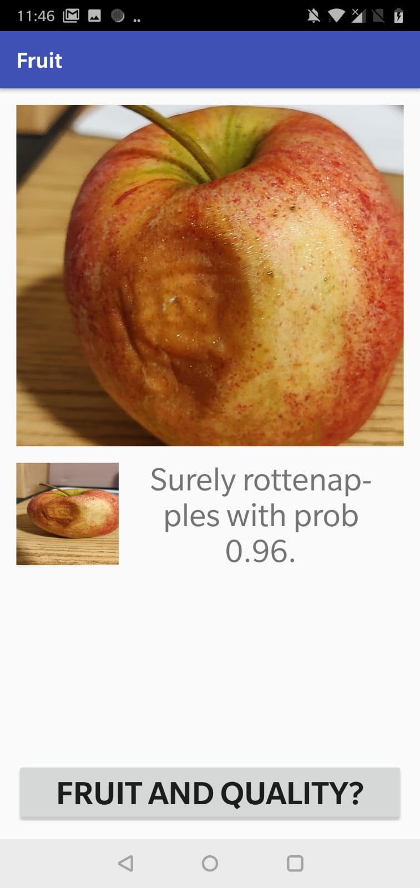
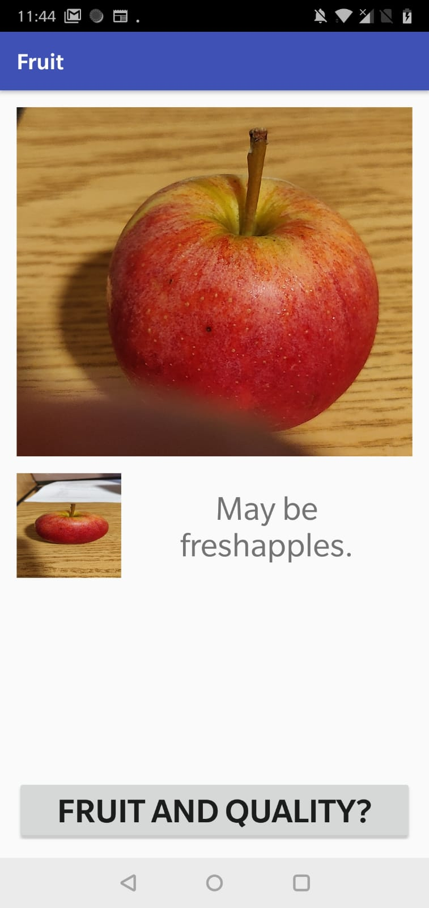
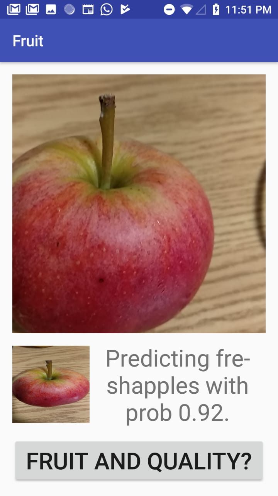

# Fruit-Quality Android App using Tensor Flow
If you wish to give this app a try in your mobile, you can create a project by opening the android_application folder using Android Studio and run the application on your phone. Please contact me if you face any issues.
Sriram Kalluri
skalluri@cs.stonybrook.edu

Android app to classify the freshness of fruits
I have used the following file to train my model by retraining the inception_v3 model based on the fruit data set created by collecting images and applied data augmentation techniques.
If you wish to train your model on a custom data set, please follow the below steps:
1)Creation of the data set
2)Use reasonable data augmentation techniques to enhance the data set.

Please use the following script to download the dataset.
   kaggle datasets download -d sriramr/fruits-fresh-and-rotten-for-classification

You can create your own dataset if you are trying to classify other fruits. 
Once you clone this dataset, you can use the train folder as image_dir for training the data.

python retrain.py --output_graph=tf_files/retrained_graph.pb --output_labels=tf_files/retrained_labels.txt --image_dir=\<path to the data set>
 
retrain.py is taken from the following github link i.e https://github.com/googlecodelabs/tensorflow-for-poets-2
This retrain.py utilizes transfer learning to quickly train on any custom data set to give good results.

  Once the model is ready, clone the tensor flow repository locally.
  Install bazel properly in your system i.e https://docs.bazel.build/versions/master/install.html
  Use the following commands in the tensorflow repository to strip the model.
                bazel build tensorflow/python/tools:strip_unused && \
                bazel-bin/tensorflow/python/tools/strip_unused \
                --input_graph=\<path to the trained model> \
                --output_graph=\<path to the stripped_model> \
                --input_node_names=Mul \
                --output_node_names=final_result \
                --input_binary=true
  
  Then clone this repository and then perform the following actions.
  
  Update the graph and labels.txt in the assets folder with the stripped_model graph and labels.
  
  Update the paths for graph and labels.txt in the MainActivity.kt
  
  Update the input layer to "Mul" in the MainActivity.kt
  
  Detailed description is given in the following blog:
  https://medium.com/@elye.project/applying-tensorflow-in-android-in-4-steps-to-recognize-superhero-f224597eb055
  
  After converting the <trained_model> using bazel to <stripped_model>, please update the graph files and images files in the assets folder.
  
  Check out the images how the app is functioning in real world.
  
  
  
  
  
  

 Since I'm using the transfer-learning and retraining on the dataset, the model behavior is not up to the mark of the state of the art. One option is: converting the model specifically trained for these images directly from tensor flow to the tfmobile.
Other options are: Utilization of GAN's for classification, exploring the State of the Art and inventing new methods. 
  
  
  

